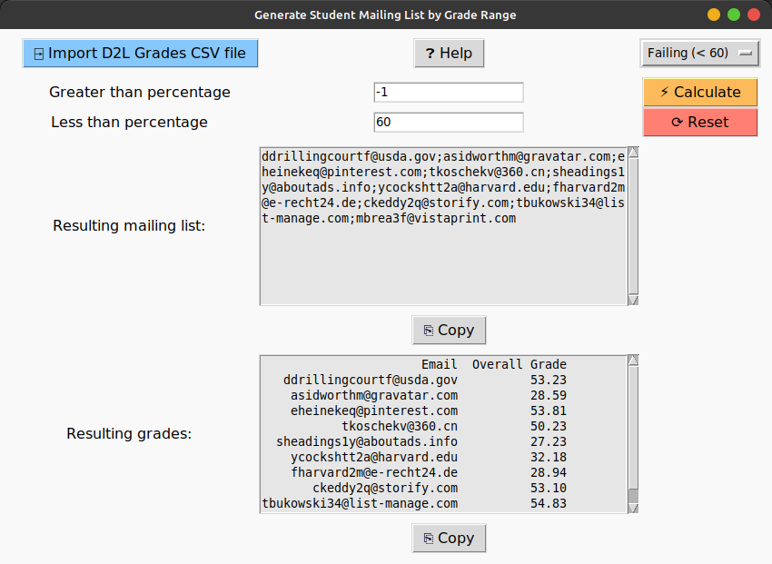

*****************************************
D2L Mailing List by Grade Range Generator
*****************************************

Quickly generate a mailing list from a of students in a certain grade range from a D2L grades export.
I designed this tool so I can quickly build a mailing list of my students failing or near failing so that
I can send email them to let them know where they stand and offer support.

CSV File Format
---------------

Although this tool was designed for instructors who use the Brightspace D2L LMS, it will really work
with any CSV file that contains two columns:

1. One column named `Email`
2. One column named `Calculated Final Grade Scheme Symbol`

The first column must contain student email addresses and the second column must contain the respective
grade for each student email address. The grades can be written in whole number or decimal form and may
optionally be written with a percent sign (%). My program treats the grades in the second column as
each student's overall grade.

\* The CSV file may contain any additional columns as they have no bearing on my program's calculations.

View my `example file <example_file_>`_.

.. _example_file: https://github.com/haasr/d2l-mailing-list-by-grade-range-generator/blob/main/D2L_MOCK_DATA_GradesExport_2024-07-26-18-27.csv

Instructions
------------

Download the `instructions <instructions_>`_ (docx file) here.

.. _instructions: https://github.com/haasr/d2l-mailing-list-by-grade-range-generator/raw/main/Compose%20Email%20List%20of%20Failing%20Students.docx

Downloads
----------

`Windows 10 x86 64-bit <win10_x86_64_>`_

.. _win10_x86_64: https://github.com/haasr/d2l-mailing-list-by-grade-range-generator/raw/main/downloads/MailingListByGradeRange_windows10_x86_64.exe]
